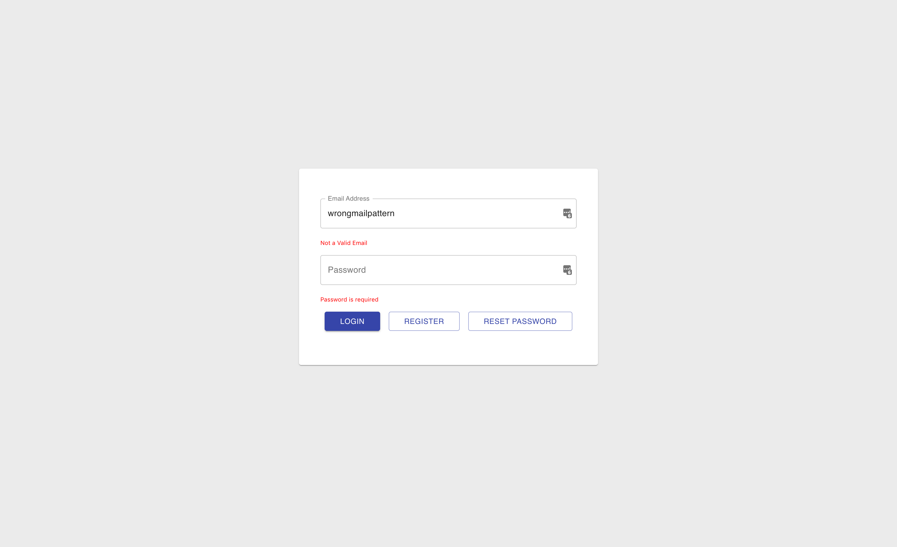
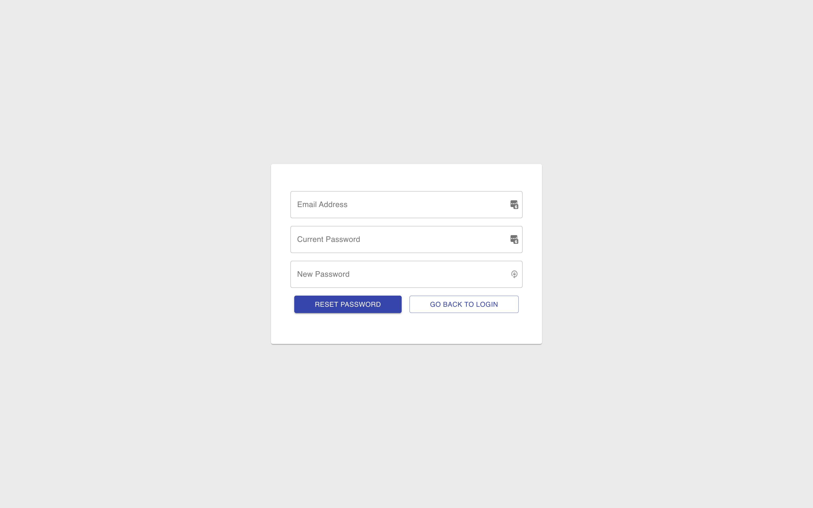
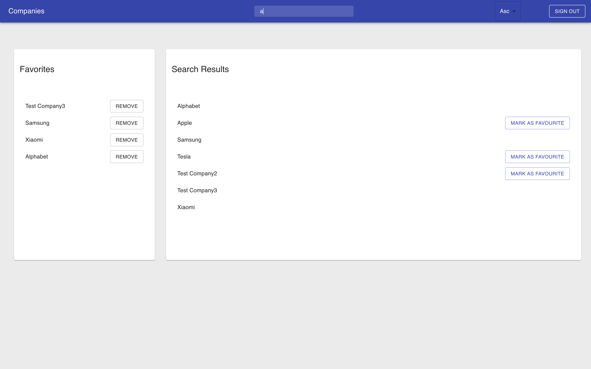
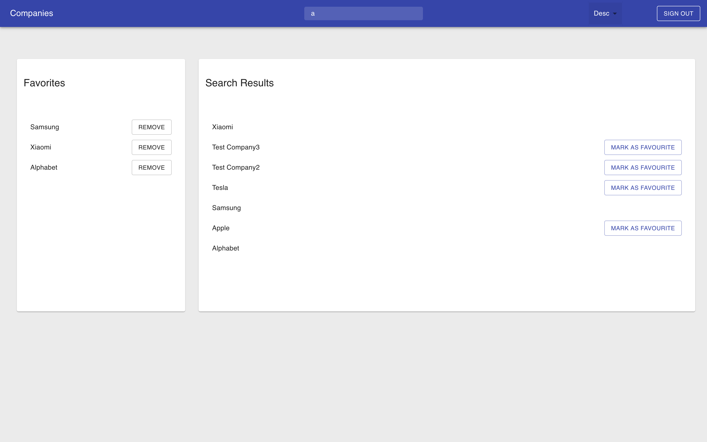

# User Service - MERN

To Run Server

```sh
$ cd server
$ npm install
$ npm run start
```

To run Client

```sh
$ cd client
$ npm install
$ npm run start
```

Sample Login - testuser@test.com/test

# Screenshots






